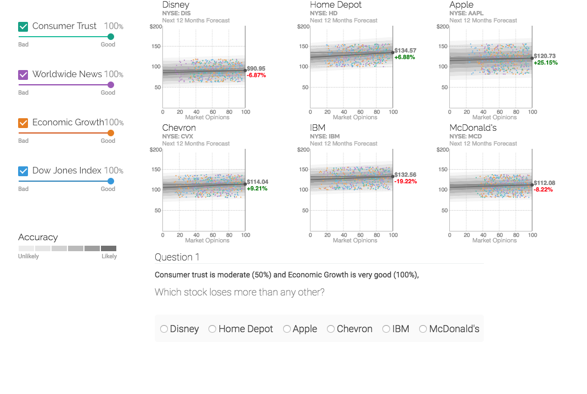

# Stock Prices Visualisation


**Available online** in the following links:


- http://stocks.ahci.work/intuitive
- http://stocks.ahci.work/detailed
- http://stocks.ahci.work/compact





```
bower install

mongoexport --db meteor --collection series --out series.json --host=127.0.0.1:3001
mongoexport --db meteor --collection stocks --out stocks.json --host=127.0.0.1:3001

mongoimport -h ds017256.mlab.com:17256 -d uncertainty -c stocks -u <username> -p <password> --file stocks.json
mongoimport -h ds017256.mlab.com:17256 -d uncertainty -c series -u <username> -p <password> --file series.json

mongoexport -h ds017256.mlab.com:17256 -d uncertainty -c answers  -u <username>  -p <password> -o output.csv --csv -f _id,userid,timestart,timeend,timespent,slider1_click,slider2_click,slider3_click,slider4_click,slider1_slide,slider2_slide,slider3_slide,slider4_slide,golden1,golden2,golden3,golden4,actions,question,correct,answer,viz,slider1,slider2,slider3,slider4

```

mongoimport --host localhost --port 3001 --db meteor --collection series --file series.json
mongoimport --host localhost --port 3001 --db meteor --collection stocks --file stocks.json
